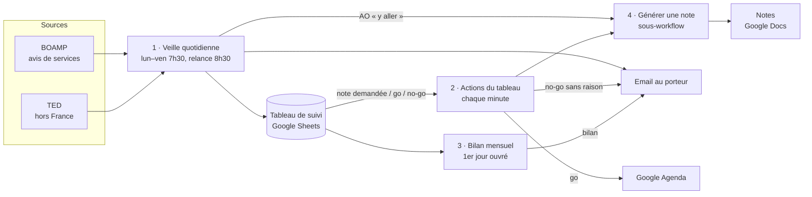

# Veille AO & décideurs publics — n8n

Automatisation n8n qui, chaque matin de semaine, repère les **appels d'offres publics** pertinents pour une entreprise de conseil, les note avec une **IA européenne (Mistral)**, rédige une **note d'analyse** pour les plus intéressants et envoie un **email récapitulatif**. Un **Google Sheets partagé** sert de tableau de suivi : décisions go / no-go, demandes de notes, historique, pondérations du score.

Statut : **lot 1 (MVP) en phase de test** — un seul destinataire (le porteur), poids et seuil du score provisoires. Le détail des exigences est dans la [spec technique](docs/specs/2026-09-29-veille-ao-architecture-design.md).

## Fonctionnement



| Workflow | Déclencheur | Rôle |
|---|---|---|
| **1 · Veille quotidienne** | lun–ven 7h30 (relance unique à 8h30 si échec) | Collecte BOAMP + TED depuis la dernière exécution réussie, pré-filtre (onglet Filtres), score Mistral par lots de 20, notes des AO « y aller » (plafond temporaire : ceux des 10 AO de l'email), email, écriture dans le tableau, alerte sur toute panne |
| **2 · Actions du tableau** | modification d'une ligne de l'onglet « Appels offres » | Note demandée → note en ~2 min ; go → 2 échéances dans l'agenda ; no-go sans raison → rappel par email |
| **3 · Bilan mensuel** | 1er jour ouvré du mois, 8h | Décisions, raisons des no-go, AO ratés, échantillon d'AO écartés → email à l'associé |
| **4 · Générer une note** | appelé par 1 et 2 | Lit les fiches références (PDF ou Google Docs), Mistral rédige les 6 rubriques obligatoires, crée le Google Doc, renvoie le lien |
| **0 · Installation du tableau** | manuel, une seule fois | Crée le Google Sheets avec ses onglets et en-têtes |

## Tableau de suivi (Google Sheets)

| Onglet | Contenu | Modifié par |
|---|---|---|
| Appels offres | un AO par ligne : score, recommandation, décision, raison du no-go, note demandée (« oui »), lien de la note | workflows + équipe |
| Décideurs | nominations du Journal officiel (lot 1, en attente) | workflow 1 |
| Organismes surveillés | clients, anciens clients, partenaires | équipe |
| AO ratés | AO pertinents trouvés par un autre canal | équipe |
| Pondérations | poids des 3 critères (sujet, acheteur, proximité) et seuil | associé |
| Filtres | codes CPV et mots-clés du pré-filtre | équipe |
| Exécutions | journal technique : période couverte, statut, volumes, coût | workflows |

> L'onglet des AO s'appelle « Appels offres » (sans apostrophe) : le déclencheur Google Sheets de n8n échoue sur les noms d'onglet contenant une apostrophe.

## Garde-fous intégrés

- Les textes des annonces sont transmis à l'IA comme **données non fiables**, jamais comme instructions.
- Chaque argument d'une note doit citer l'annonce ou une fiche référence identifiée, sinon « aucune preuve trouvée ».
- Un AO n'apparaît qu'une fois dans l'email ; aucune annonce n'est perdue (période = depuis la dernière exécution réussie).
- Aucun poids n'est modifié automatiquement ; un no-go n'est pris en compte qu'avec sa raison ; alerte au-delà de 10 notes demandées par jour.
- Une configuration vide ou incomplète (onglet Filtres, Pondérations) arrête la veille avec une alerte, au lieu de produire un email vide ou des scores à zéro en silence.

## Contenu du dépôt

```
n8n/
  workflows/Sandbox/Veille AO · *.workflow.ts   # workflows (SDK n8n, TypeScript)
  config/                                       # configuration n8ncli
docs/specs/                         # spec technique et décisions
```

Les workflows sont exportés depuis n8n Cloud avec [`n8ncli`](https://www.npmjs.com/package/@workflows-accelerator/n8n-cli) (`n8ncli pull`). **Aucun secret n'est versionné** : les identifiants (Google, Gmail, Mistral) restent chiffrés dans n8n et les workflows ne font référence qu'à leur nom.

## Réinstaller sur une autre instance n8n

1. Installer `n8ncli` (Node.js ≥ 20) : `npm install -g @workflows-accelerator/n8n-cli`
2. `n8ncli init --url https://<instance>.app.n8n.cloud --access-token <jeton MCP>` (jeton : Settings → Instance-level MCP → Connect)
3. `n8ncli push` pour créer les workflows (procédure non encore éprouvée sur une instance vierge), puis dans n8n :
   - créer les identifiants Google Sheets, Google Drive, Google Docs, Gmail, Google Calendar et Mistral Cloud ;
   - lancer « 0 · Installation du tableau », puis reporter l'ID du tableur, du dossier des fiches références et du dossier des notes dans les nœuds concernés ;
   - publier **4** avant **1** et **2** (n8n exige qu'un sous-workflow soit publié avant ses appelants).

## Reste à faire (lot 1)

- Journal officiel (section Décideurs) : compte PISTE / API Légifrance en production.
- Validation des poids et du seuil par un associé ; test chiffré (≥ 8/10 AO pertinents retrouvés, ≤ 3/10 faux positifs).
- Email de l'associé pour le bilan mensuel ; tableur clients complet.
- Avant élargissement à l'équipe : messagerie et agenda professionnels, validation du traitement des données des décideurs.
