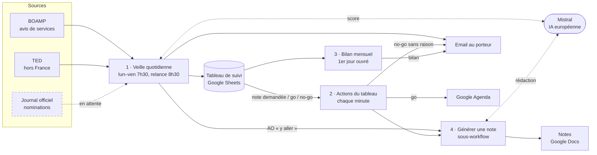
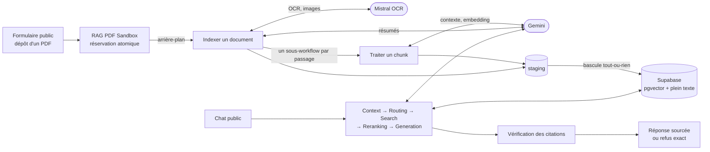

# Automatisations n8n — M2

Deux projets construits sur n8n Cloud, chacun avec sa spécification, ses garde-fous et ses tests en conditions réelles :

| Projet | Ce que ça fait | État | Spec |
|---|---|---|---|
| [**1 · Veille AO & décideurs publics**](#1--veille-ao--décideurs-publics) | Chaque matin, repère les appels d'offres publics pertinents, les note avec Mistral, rédige des notes d'analyse et envoie un email ; un Google Sheets partagé sert de tableau de suivi. | lot 1 en phase de test, en service depuis le 30/09/2026 | [spec](docs/specs/2026-09-29-veille-ao-architecture-design.md) |
| [**2 · RAG PDF Sandbox**](#2--rag-pdf-sandbox) | Répond à des questions sur des PDF déposés, uniquement avec des citations exactes (document, page, extrait vérifié) ; refuse hors de la base. | lots 1 et 2 livrés, deux livres indexés au 02/10/2026 | [spec](docs/specs/2026-09-30-rag-pdf-sandbox-specs.md) |

Les deux projets ont été menés avec la même [méthode](#méthode) (interview, relecture hostile, doute systématique). Le [contenu du dépôt](#contenu-du-dépôt) est décrit en fin de page.

---

## 1 · Veille AO & décideurs publics

Automatisation n8n qui, chaque matin de semaine, repère les **appels d'offres publics** pertinents pour une entreprise de conseil, les note avec une **IA européenne (Mistral)**, rédige une **note d'analyse** pour les plus intéressants et envoie un **email récapitulatif**. Un **Google Sheets partagé** sert de tableau de suivi : décisions go / no-go, demandes de notes, historique, pondérations du score.

Deux rôles reviennent dans cette section : le **porteur** (responsable du projet, seul destinataire pendant la phase de test) et l'**associé** (valide les pondérations du score et reçoit le bilan mensuel).

Statut : **lot 1 (MVP) en phase de test**, en service depuis le 30 septembre 2026. Le détail des exigences, des choix et des limites est dans la [spec technique](docs/specs/2026-09-29-veille-ao-architecture-design.md).

### Problème et objectifs

La veille des appels d'offres et des changements de décideurs est faite à la main : elle prend du temps et laisse passer des opportunités. Le projet réussit s'il **ne laisse passer aucun appel d'offres pertinent** et **fait gagner au moins 2 heures de veille par semaine**.

| Indicateur | Cible | Mesure |
|---|---|---|
| AO pertinents ratés | zéro par mois | signalement par l'équipe (onglet « AO ratés ») + revue mensuelle d'un échantillon d'AO écartés |
| Temps de veille économisé | ≥ 2 h par semaine | comparaison avec le temps de veille manuelle |
| Qualité du score (test chiffré, avant élargissement) | ≥ 8 AO pertinents retrouvés sur 10, ≤ 3 faux positifs sur 10 retenus | lot d'AO passés étiqueté par deux personnes |

Le lot 1 couvre trois sources gratuites : le BOAMP (bulletin national des marchés), TED (journal européen des marchés) et le Journal officiel (nominations). Les lots 2 et 3 (sources secondaires, traduction, page web dédiée) ne démarrent qu'une fois le lot 1 validé.

### Fonctionnement



| Workflow | Déclencheur | Rôle |
|---|---|---|
| **1 · Veille quotidienne** | lun–ven 7h30 ; relance unique à 8h30 si 7h30 a échoué | Collecte BOAMP + TED depuis la dernière exécution réussie → pré-filtre (onglet Filtres) → score Mistral par lots de 20 → notes des AO « y aller » (plafond : ceux des 10 AO de l'email) → email → écriture dans le tableau. Toute panne alerte le porteur. |
| **2 · Actions du tableau** | modification d'une ligne de l'onglet « Appels offres » | Note demandée → note en ~2 min ; go → 2 échéances dans l'agenda ; no-go sans raison → rappel par email |
| **3 · Bilan mensuel** | 1er jour ouvré du mois, 8h | Décisions, raisons des no-go, AO ratés, échantillon d'AO écartés → email à l'associé |
| **4 · Générer une note** | appelé par 1 et 2 | Lit les fiches références (PDF ou Google Docs), Mistral rédige les 6 rubriques obligatoires, crée le Google Doc, renvoie le lien |
| **0 · Installation du tableau** | manuel, une seule fois | Crée le Google Sheets avec ses onglets et en-têtes |

### Tableau de suivi (Google Sheets)

| Onglet | Contenu | Modifié par |
|---|---|---|
| Appels offres | un AO par ligne : score, recommandation, décision, raison du no-go, note demandée (« oui »), lien de la note | workflows + équipe |
| Décideurs | nominations du Journal officiel (lot 1, en attente) | workflow 1 |
| Organismes surveillés | clients, anciens clients, partenaires | équipe |
| AO ratés | AO pertinents trouvés par un autre canal | équipe |
| Pondérations | poids des 3 critères (sujet, acheteur, proximité) et seuil | associé |
| Filtres | codes CPV et mots-clés du pré-filtre | équipe |
| Exécutions | journal technique : période couverte, statut, volumes, coût | workflows |

> L'onglet des AO s'appelle « Appels offres » (sans apostrophe) : le déclencheur Google Sheets de n8n échoue sur les noms d'onglet contenant une apostrophe.

### Garde-fous intégrés

- Les textes des annonces sont transmis à l'IA comme **données non fiables**, jamais comme instructions.
- Chaque argument d'une note doit citer l'annonce ou une fiche référence identifiée, sinon « aucune preuve trouvée ».
- Un AO n'apparaît qu'une fois dans l'email ; aucune annonce n'est perdue (période = depuis la dernière exécution réussie, sources interrogées depuis la veille).
- Aucun poids n'est modifié automatiquement ; un no-go n'est pris en compte qu'avec sa raison ; alerte au-delà de 10 notes demandées par jour.
- Une configuration vide ou incomplète (onglet Filtres, Pondérations) arrête la veille avec une alerte, au lieu de produire un email vide ou des scores à zéro en silence.

### État au 30 septembre 2026

| Élément | État |
|---|---|
| Workflows 1, 2 et 4 | publiés, testés en conditions réelles |
| Workflow 3 (bilan mensuel) | configuré, non publié : adresse de l'associé à renseigner |
| Journal officiel (section Décideurs) | en attente de l'accès à l'API Légifrance (compte PISTE) |
| Première exécution planifiée (30/09, 7h30) | succès en 7 min : 349 annonces examinées, 69 nouvelles après pré-filtre, 23 « y aller », 10 notes rédigées, email envoyé ; relance de 8h30 arrêtée en 3 s comme prévu |
| Workflow 2 | testé sur une ligne de test : rappel de no-go reçu, 2 échéances créées, note produite en ~2 min |
| Coût par jour (ordre de grandeur, estimé) | ~4 à 10 appels Mistral pour le score + 10 notes à ~13 000 tokens ; ~12 exécutions n8n |

### Limites connues et arbitrages ouverts

Assumés et documentés dans la spec (section « Écarts assumés » et « Relecture hostile du 2026-09-30 ») :

- les notes automatiques sont limitées aux AO « y aller » parmi les 10 de l'email, tant que le seuil n'est pas calibré par le test chiffré ;
- le coût est **estimé** (≈ 4 caractères par token), pas mesuré ;
- les poids et le seuil du score sont **provisoires** ; le score est jugé encore généreux ;
- un doublon d'email reste possible si l'exécution s'interrompt dans les secondes qui séparent l'envoi de l'écriture dans le tableau ;
- l'alerte de panne passe par Gmail : si Gmail est la cause de la panne, elle ne part pas.

### Reste à faire (lot 1)

- Journal officiel (section Décideurs) : compte PISTE / API Légifrance en production, puis règle de conservation des données personnelles.
- Validation des poids et du seuil par un associé ; test chiffré (≥ 8/10 AO pertinents retrouvés, ≤ 3/10 faux positifs).
- Email de l'associé pour le bilan mensuel ; tableur clients complet.
- Avant élargissement à l'équipe : messagerie et agenda professionnels, validation du traitement des données des décideurs.

---

## 2 · RAG PDF Sandbox

Un assistant qui répond à des questions sur des PDF déposés publiquement, **uniquement à partir de ce qu'il peut prouver**. Chaque affirmation est suivie du nom du document, de la page (page du PDF et page imprimée) et d'un extrait copié mot pour mot dans la langue du document, **vérifié automatiquement** contre le texte indexé. Quand l'information n'est pas dans la base, la réponse est exactement « Je ne trouve pas cette information dans les documents. », sans appel au modèle.

Statut : **lots 1 et 2 livrés** (dépôt, indexation de qualité production, réponse en cinq étapes), deux livres indexés. Exigences, faits testés, limites et arbitrages : [spec technique](docs/specs/2026-09-30-rag-pdf-sandbox-specs.md).

### Problème et objectifs

Un RAG « classique » répond souvent à côté : il extrapole, cite de mémoire, mélange ses connaissances et le document. L'exercice demande l'inverse : un assistant qui ne dit que ce que le document dit, et qui le prouve.

| Indicateur | Cible | Résultat mesuré |
|---|---|---|
| Réponses correctement sourcées sur un jeu de 7 questions dans le document | ≥ 6 sur 7 | **20 sur 21** sur 3 tours (la réponse manquante est une erreur technique 503 de Google, pas une mauvaise réponse) |
| Refus corrects sur 3 questions hors sujet | 3 sur 3 | **9 sur 9** sur 3 tours, avec la phrase exacte |
| Extraits vérifiables mot pour mot dans le PDF | 100 % | contrôlé automatiquement à chaque réponse (distance d'édition, remplacement par le texte exact, contrôle de page) |
| Temps de réponse | — | médiane 7,2 s |

### Fonctionnement



| Workflow | Déclencheur | Rôle |
|---|---|---|
| **RAG PDF** (le workflow principal) | formulaire public ; chat public | Dépôt : contrôle (≤ 500 pages), empreinte SHA-256, réservation atomique, lancement de l'indexation sans attente. Chat : historique de session (Postgres), routage LLM (question autonome, requêtes multiples, traduction, documents visés, question ambiguë, HyDE), recherche hybride RRF (vecteurs + plein texte, voisins, chapitres, quota par document), juge de pertinence Gemini, génération avec mémoire, vérification des citations, journal des questions. |
| **Indexer un document** | appelé par le dépôt | OCR Mistral page par page, description des images, nettoyage (en-têtes, folios), pages imprimées et chapitres lus dans les en-têtes, résumé du document, découpage récursif borné à la page (index et table des matières écartés), résumés de chapitre (avec seconde passe après saturation), contrôle de complétude puis bascule atomique en production. |
| **Traiter un chunk** | appelé par l'indexation, une fois par passage | Phrase de contexte et mots-clés bilingues (contextual retrieval), embedding, insertion en staging. L'échec d'un passage ne touche pas les autres. |

### Garde-fous intégrés

- **Refus par un seuil, jamais par le modèle** : sans passage du document au-dessus de 0,60 de similarité, la réponse fixe de refus part sans appeler le générateur ; le routeur ne peut pas refuser lui-même.
- **Citations vérifiées après génération** : extrait retrouvé dans le passage (distance d'édition), remplacé par le texte exact, allongé jusqu'à sa phrase ; page contrôlée ; résumés et descriptions générés jamais citables.
- **Indexation tout ou rien** : staging puis bascule atomique ; un document est interrogeable d'un coup ou pas du tout ; redépôt possible seulement après échec.
- **Contenu des PDF et de l'historique traités comme des données**, jamais comme des instructions ; dépôt public assumé et affiché (le PDF passe chez Mistral puis Google ; le fichier envoyé pour les images est supprimé chez Mistral aussitôt).
- **Pannes lisibles** : 503 de Google réessayés, repli sur l'ordre RRF si le juge échoue, question brute si le routeur échoue, message de saturation explicite si la génération échoue trois fois ; réponse vide (filtre RECITATION) signalée, jamais transformée en faux refus.
- **Plusieurs documents** : question ambiguë → liste des documents et demande de précision, jamais un choix arbitraire ; question sur plusieurs documents → recherche document par document et réponse organisée par document.

### État au 2 octobre 2026

| Élément | État |
|---|---|
| Trois workflows | publiés, testés en conditions réelles |
| Documents indexés | *Economics Explained* (258 pages, 246 passages, 22 résumés, 242 pages imprimées lues) et *What Are You Doing Here?* (274 pages, 274 passages, 18 résumés, 16 images décrites) |
| Jeu de 10 questions × 3 tours | 20 réponses justes sur 21, 9 refus sur 9, médiane 7,2 s |
| Conversations | questions de suivi comprises grâce à l'historique (testé sur 3 tours) ; questions à deux documents et questions ambiguës testées |
| Indexation | 7 min pour 258 pages quand Google n'est pas saturé ; 19 min observées sous saturation |

### Limites connues et arbitrages ouverts

Assumés et documentés dans la spec (sections « Hypothèses et contraintes » et « Points ouverts ») :

- les extraits sont limités à 12 mots à la génération (filtre RECITATION de Google), puis allongés jusqu'à leur phrase par la vérification, 30 mots au plus ;
- deux nodes imposés ont été remplacés, de façon documentée : « Embeddings Google Gemini » par un appel HTTP (il stockait des vecteurs vides sans erreur en cas de quota dépassé) et « Vector Store Supabase » par des requêtes SQL (atomicité, recherche hybride, métadonnées) ;
- la description des images et les résumés de chapitre sont facultatifs : s'ils échouent, le document est indexé sans eux ;
- le seuil 0,60 et la détection des chapitres ont été calibrés sur deux livres ; un rapport ou un mémoire reste à tester ;
- un enchaînement de plus de 6 questions par minute déclenche des 503 chez Google (usage à un utilisateur non concerné) ;
- pas d'interface de gestion des documents, pas de modération du contenu déposé, pas d'authentification ; rétention indéfinie.

---

## Méthode

Les deux projets ont été menés avec trois fiches de méthode réutilisables, versionnées dans [`skills/`](skills/), qui s'enchaînent :

1. [**interview**](skills/interview/SKILL.md) : cadrage par entretien, une question à la fois, jusqu'à une spécification vérifiable, puis exploration de ce qui existe déjà avant de figer le besoin. C'est ainsi que les deux specs ont été produites.
2. [**hostile-review**](skills/hostile-review/SKILL.md) : relecture adversariale de la spec puis de la réalisation (la lettre contre l'esprit, contenus malveillants, dérive dans le temps, contradictions, exigences invérifiables, poids). Ses conclusions sont intégrées aux specs.
3. [**doubt-driven-dev**](skills/doubt-driven-dev/SKILL.md) : avant qu'une décision ne compte, tenter de la réfuter : test réel pour ce qui touche au monde extérieur (c'est ce qui a montré que le BOAMP publie aussi en journée, ou que le node d'embeddings avalait les erreurs de quota), relecteur sans contexte pour le raisonnement.

Chaque fiche est un fichier Markdown autonome, applicable à tout projet, pas seulement aux automatisations.

## Contenu du dépôt

```
n8n/
  workflows/Projects/Veille AO/   # les 5 workflows de la veille (SDK n8n, TypeScript)
  workflows/Projects/RAG PDF/     # les 3 workflows du RAG PDF Sandbox
  config/                         # configuration n8ncli
docs/
  specs/                          # specs techniques des deux projets, décisions, relectures hostiles
  reinstallation.md               # réinstaller la veille sur une autre instance n8n
skills/                           # méthode : interview, hostile-review, doubt-driven-dev
```

Les workflows sont exportés depuis n8n Cloud avec [`n8ncli`](https://www.npmjs.com/package/@workflows-accelerator/n8n-cli) (`n8ncli pull`). **Aucun secret n'est versionné** : les identifiants (Google, Gmail, Mistral, Gemini, Supabase) restent chiffrés dans n8n et les workflows ne font référence qu'à leur nom. Pour réinstaller la veille sur une autre instance : [docs/reinstallation.md](docs/reinstallation.md).
